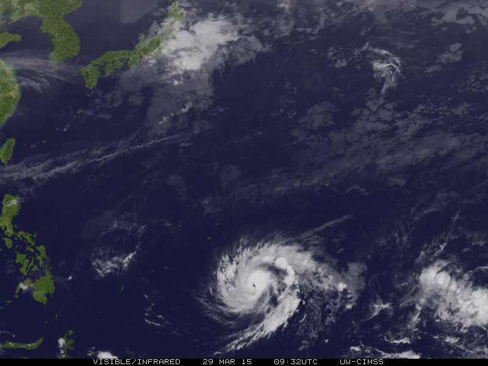

<h1 align="center">weatherForecast</h1>

  

<h2 align="center"><a  href="https://kazakovaolga.github.io/weatherForecast/">Live Demo</a></h2>

## Description

An application for getting a weather forecast implemented in javascript as part of the OTUS JavaScript Developer course. Basic.

## How to use

- When opening the page, the user sees the weather (city, temperature and icon, map) in their area
- The user can enter the name of the city in the input field and, when clicking on the button, see the weather in the selected city (city, temperature, icon and map of the area)
- the previously entered cities are saved in the user's browser, so that he sees the last 10 cities where he watched the weather
- when clicking on a city line in the list, he sees the weather in the selected city (city, temperature, icon and map of the area)

